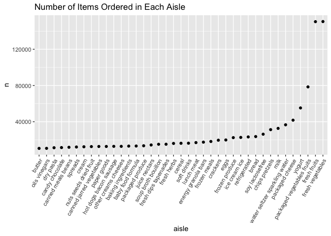
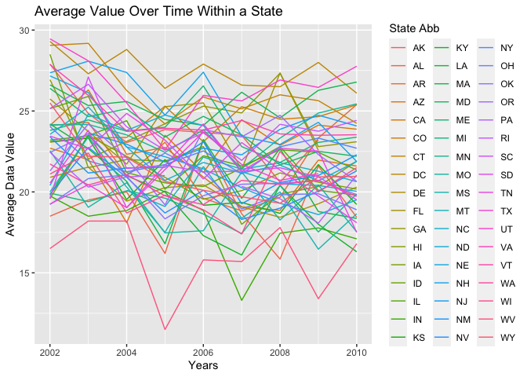
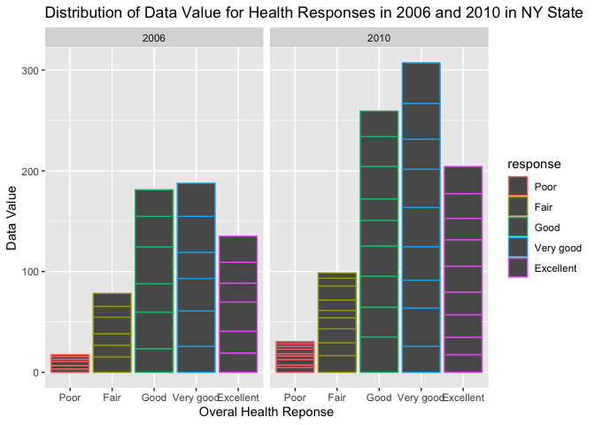
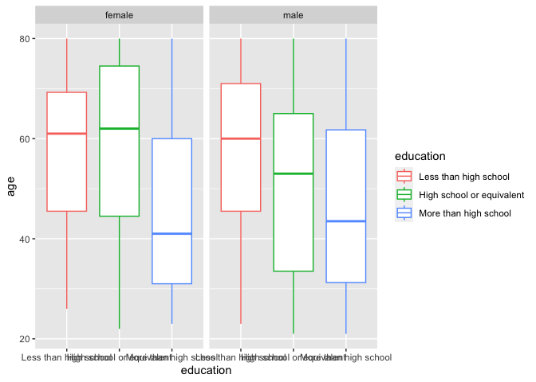
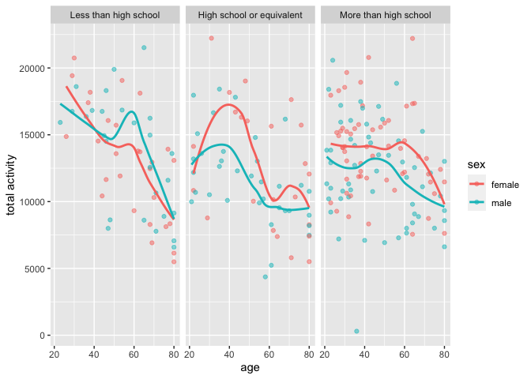
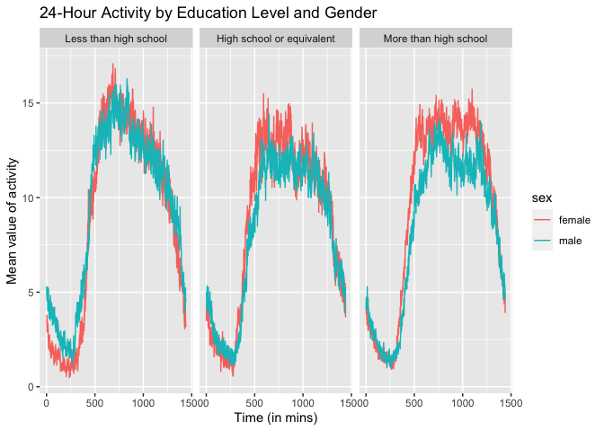

P8105 Homework 3
================
Laylah Jones
2023-10-14

# Problem 1

### Loading Data

``` r
library(p8105.datasets)
data("instacart")
```

## Part 1. Description of instacart data

The instacart data set contains information about online grocery
shopping from 2017, with 1384617 observations and 15 variables. Totaling
at 20769255 data points. Key variables include `order_id`, `product_id`,
`user_id`, if an item was `reordered`, `order_hour_of_day`,
`days_since_prior_order` (ranging from 0 to 30), `product_name`,
`aisle`, and `department`.

## Part 2. Exploring the data

### How many aisles are there, and which aisles are the most items ordered from?

``` r
instacart |> 
  group_by(aisle_id, aisle) |> 
  summarize(n_obs = n()) |> 
  arrange(desc(n_obs))
```

    ## `summarise()` has grouped output by 'aisle_id'. You can override using the
    ## `.groups` argument.

    ## # A tibble: 134 × 3
    ## # Groups:   aisle_id [134]
    ##    aisle_id aisle                          n_obs
    ##       <int> <chr>                          <int>
    ##  1       83 fresh vegetables              150609
    ##  2       24 fresh fruits                  150473
    ##  3      123 packaged vegetables fruits     78493
    ##  4      120 yogurt                         55240
    ##  5       21 packaged cheese                41699
    ##  6      115 water seltzer sparkling water  36617
    ##  7       84 milk                           32644
    ##  8      107 chips pretzels                 31269
    ##  9       91 soy lactosefree                26240
    ## 10      112 bread                          23635
    ## # ℹ 124 more rows

There are 134 aisles. `fresh vegetables`, `fresh fruits`, and
`packaged vegetable fruits` are the three most ordered items.

### Make a plot that shows the number of items ordered in each aisle, limiting this to aisles with more than 10000 items ordered. Arrange aisles sensibly, and organize your plot so others can read it.

``` r
instacart |>  
  count(aisle) |> 
  filter(n > 10000) |> 
  mutate(aisle = fct_reorder(aisle, n)) |> 
  ggplot(aes(x = aisle, y = n)) + 
  geom_point() + 
  labs(title = "Number of Items Ordered in Each Aisle") +
  theme(axis.text.x = element_text(angle = 60, hjust = 1))
```

<!-- -->

### Make a table showing the three most popular items in each of the aisles “baking ingredients”, “dog food care”, and “packaged vegetables fruits”. Include the number of times each item is ordered in your table.

``` r
instacart |>
  filter(aisle %in% c("baking ingredients", "dog food care", "packaged vegetables fruits")) |>
  group_by(aisle) |>
  count(product_name) |>
  mutate(rank = min_rank(desc(n))) |>
  filter(rank < 4) |>
  arrange(desc(n)) |>
  knitr::kable()
```

| aisle                      | product_name                                  |    n | rank |
|:---------------------------|:----------------------------------------------|-----:|-----:|
| packaged vegetables fruits | Organic Baby Spinach                          | 9784 |    1 |
| packaged vegetables fruits | Organic Raspberries                           | 5546 |    2 |
| packaged vegetables fruits | Organic Blueberries                           | 4966 |    3 |
| baking ingredients         | Light Brown Sugar                             |  499 |    1 |
| baking ingredients         | Pure Baking Soda                              |  387 |    2 |
| baking ingredients         | Cane Sugar                                    |  336 |    3 |
| dog food care              | Snack Sticks Chicken & Rice Recipe Dog Treats |   30 |    1 |
| dog food care              | Organix Chicken & Brown Rice Recipe           |   28 |    2 |
| dog food care              | Small Dog Biscuits                            |   26 |    3 |

### Make a table showing the mean hour of the day at which Pink Lady Apples and Coffee Ice Cream are ordered on each day of the week; format this table for human readers (i.e. produce a 2 x 7 table).

``` r
instacart |> 
  filter(product_name %in% c("Pink Lady Apples", "Coffee Ice Cream")) |> 
  group_by(product_name, order_dow) |> 
  summarize(mean_hour = mean(order_hour_of_day)) |> 
  spread(key = order_dow, value = mean_hour) |> 
  knitr::kable(digits = 2)
```

    ## `summarise()` has grouped output by 'product_name'. You can override using the
    ## `.groups` argument.

| product_name     |     0 |     1 |     2 |     3 |     4 |     5 |     6 |
|:-----------------|------:|------:|------:|------:|------:|------:|------:|
| Coffee Ice Cream | 13.77 | 14.32 | 15.38 | 15.32 | 15.22 | 12.26 | 13.83 |
| Pink Lady Apples | 13.44 | 11.36 | 11.70 | 14.25 | 11.55 | 12.78 | 11.94 |

# Problem 2

### Loading Data

``` r
library(p8105.datasets)
data("brfss_smart2010")
```

## Part 1. Data cleaning

``` r
brfss = brfss_smart2010 |>
  janitor::clean_names() |>
  filter(topic == "Overall Health", 
         response %in% c("Poor", "Fair", "Good", "Very good", "Excellent")) |> 
  mutate(
    response = fct_relevel(response, c("Poor", "Fair", "Good", "Very good", "Excellent"))
    )
```

## Part 2. Comments on the results

### In 2002, which states were observed at 7 or more locations? What about in 2010?

``` r
brfss |> 
  filter(year %in% c("2002", "2010")) |> 
  group_by(year, locationabbr) |> 
  summarize(nloc = n_distinct(geo_location)) |> 
  filter(nloc >= 7) |> 
  knitr::kable()
```

    ## `summarise()` has grouped output by 'year'. You can override using the
    ## `.groups` argument.

| year | locationabbr | nloc |
|-----:|:-------------|-----:|
| 2002 | CT           |    7 |
| 2002 | FL           |    7 |
| 2002 | MA           |    8 |
| 2002 | NC           |    7 |
| 2002 | NJ           |    8 |
| 2002 | PA           |   10 |
| 2010 | CA           |   12 |
| 2010 | CO           |    7 |
| 2010 | FL           |   41 |
| 2010 | MA           |    9 |
| 2010 | MD           |   12 |
| 2010 | NC           |   12 |
| 2010 | NE           |   10 |
| 2010 | NJ           |   19 |
| 2010 | NY           |    9 |
| 2010 | OH           |    8 |
| 2010 | PA           |    7 |
| 2010 | SC           |    7 |
| 2010 | TX           |   16 |
| 2010 | WA           |   10 |

Based on the results, in 2002, 6 states (CT, FL, MA, NC, NJ, PA) were
observed at 7 or more locations. While in 2010, 14 states (CA, CO, FL,
MA, MD, NC, NE, NJ, NY, OH, PA, SC, TX, WA) were observed at 7 or more
locations.

### Construct a dataset that is limited to Excellent responses, and contains, year, state, and a variable that averages the data_value across locations within a state.

``` r
excell_df = 
  brfss |> 
  filter(response == "Excellent") |> 
  select(year, locationabbr, data_value) |> 
  group_by(year, locationabbr) |> 
  summarize(mean_data = mean(data_value))
```

    ## `summarise()` has grouped output by 'year'. You can override using the
    ## `.groups` argument.

### Make a “spaghetti” plot of this average value over time within a state (that is, make a plot showing a line for each state across years – the geom_line geometry and group aesthetic will help).

``` r
excell_df |>  
  ggplot(aes(x = year, y = mean_data, color = locationabbr)) +
  geom_line() +
  labs(title = "Average Value Over Time Within a State", x = "Years", y = "Average Data Value", color = "State Abb")
```

    ## Warning: Removed 3 rows containing missing values (`geom_line()`).

<!-- -->

It is difficult to determine a direct pattern from the “Excellent”
response data, however one can see that the data from West Virginia
declined drastically in 2005. Other than that the data is fairly
clustered.

### Make a two-panel plot showing, for the years 2006, and 2010, distribution of data_value for responses (“Poor” to “Excellent”) among locations in NY State.

``` r
brfss |> 
  filter(year == "2006" | year == "2010", 
         locationabbr == "NY") |> 
  ggplot(aes(x = response, y = data_value, color = response)) +
  geom_col() + 
  facet_wrap(~ year) + 
  labs(
    title = "Distribution of Data Value for Health Responses in 2006 and 2010 in NY State", 
    x = "Overal Health Reponse", 
    y = "Data Value",
    )
```

<!-- -->

Individuals who had responded “Very Good” to the survey responses had
the highest data value in both 2006 and 2010, with its value rising a
little over 100 between the years. Individuals who had responded “Poor”
to the survey responses had the lowest data value in both 2006 and 2010.

# Problem 3

### Part 1. Load, tidy, merge, and organize the data sets

``` r
accel = read_csv("./data/nhanes_accel.csv")
```

    ## Rows: 250 Columns: 1441
    ## ── Column specification ────────────────────────────────────────────────────────
    ## Delimiter: ","
    ## dbl (1441): SEQN, min1, min2, min3, min4, min5, min6, min7, min8, min9, min1...
    ## 
    ## ℹ Use `spec()` to retrieve the full column specification for this data.
    ## ℹ Specify the column types or set `show_col_types = FALSE` to quiet this message.

``` r
demo = read_csv("./data/nhanes_covar.csv", skip = 4)
```

    ## Rows: 250 Columns: 5
    ## ── Column specification ────────────────────────────────────────────────────────
    ## Delimiter: ","
    ## dbl (5): SEQN, sex, age, BMI, education
    ## 
    ## ℹ Use `spec()` to retrieve the full column specification for this data.
    ## ℹ Specify the column types or set `show_col_types = FALSE` to quiet this message.

``` r
demo_tidy = 
  demo |> 
  filter(age >= 21) |> 
  drop_na() |>
  mutate(
    sex = recode(sex, "1" = "male", "2" = "female")) |> 
  mutate(
    education = recode(education, "1" = "Less than high school", "2" = "High school or equivalent", "3" = "More than high school")) |>
  mutate(education = factor(education, levels = c("Less than high school", "High school or equivalent", "More than high school")))

demo_accel = 
  demo_tidy |> 
  left_join(accel, by = "SEQN")
```

### Part 2. Produce a table for the number of men and women in each education category. And produce a visualization of the age distributions based on the table.

``` r
demo_accel |> 
  group_by(sex, education) |> 
  summarize(n_people = n()) |> 
  pivot_wider(
    names_from = education,
    values_from = n_people
  ) |> 
  knitr::kable()
```

    ## `summarise()` has grouped output by 'sex'. You can override using the `.groups`
    ## argument.

| sex    | Less than high school | High school or equivalent | More than high school |
|:-------|----------------------:|--------------------------:|----------------------:|
| female |                    28 |                        23 |                    59 |
| male   |                    27 |                        35 |                    56 |

``` r
demo_accel |> 
  ggplot(aes(x = education, y = age, color = education)) +
  geom_boxplot() +
  facet_grid(.~sex)
```

<!-- -->

In total, there are 118 males and 110 females in the study. The box plot
shows the age distribution of men and women in each education category.
From the plot you can see that younger individuals tend to have a higher
education than older individuals. There are slightly more males in the
more than high school group than females and more females in the high
school or equivalent group than males.

### Part 3. Create a total activity variable for each participant and plot

``` r
demo_accel |> 
  mutate(
   tot_activity = rowSums(across(min1:min1440), na.rm = TRUE) 
  ) |> 
  ggplot(aes(x = age, y = tot_activity, color = sex)) + 
  geom_point(alpha = 0.5) +
  geom_smooth(se = FALSE) +
  labs(y = "total activity") +
  facet_grid(.~education)
```

    ## `geom_smooth()` using method = 'loess' and formula = 'y ~ x'

<!-- -->

The plot shows the total activity for each participant based on their
age, while comparing men and women, and separating them into three
separate panels for each education level. From the plot, you can see
that total activity generally decreases as age increases. In the Less
than high school group, men have higher total activity than women,
however in the other two groups women have the higher total activity
than men.

### Part 4. Make a three-panel plot that shows the 24-hour activity time courses for each education level and use color to indicate sex.

``` r
all_day = demo_accel |> 
  group_by(education, sex) |> 
  summarize(across(starts_with("min"), ~ mean(.), .names = "mean_{.col}"), .groups = "drop") |> 
  pivot_longer(cols = starts_with("mean_"), names_to = "time", values_to = "mean")|>
  mutate(
    time = substring(time, 9),
    time = as.numeric(time)
  )
ggplot(all_day, aes(x = time, y = mean, color = sex)) +
  geom_line() +
  facet_grid(. ~education) +
  labs(title = "24-Hour Activity by Education Level and Gender", 
       x = "Time (in mins)",
       y = "Mean value of activity")
```

<!-- -->

The three-panel plot shows the 24-hour activity time courses for each
education level separated by sex. It can be seen that women have a
higher mean value of activity than men in all three panels. In the “Less
than high school” panel, there is a more relevant mean value of activity
than in the other education groups.
